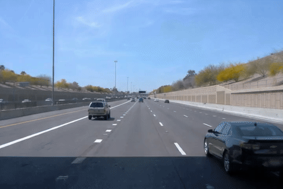
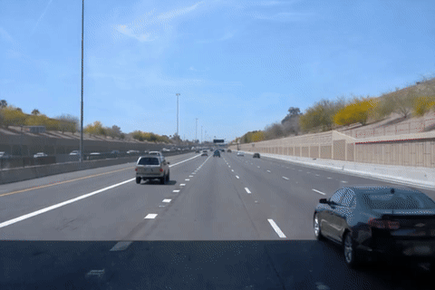
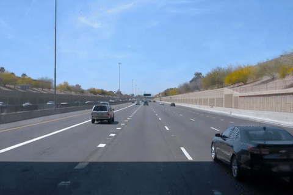
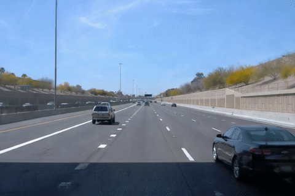

<div align="center">

# Motion Forcing: A Decoupled Framework for Robust Video Generation in Motion Dynamics

[](https://arxiv.org/abs/2603.10408)
[](https://tianshuo-xu.github.io/Motion-Forcing/)
[](https://huggingface.co/TSXu/MotionForcing_driving)

**Tianshuo Xu<sup>1</sup>, Zhifei Chen<sup>1</sup>, Leyi Wu<sup>1</sup>, Hao Lu<sup>1</sup>, Ying-cong Chen<sup>1,2\*</sup>**

<sup>1</sup>HKUST (GZ) &nbsp;&nbsp; <sup>2</sup>HKUST &nbsp;&nbsp; \* corresponding author

</div>

Motion Forcing decouples physical reasoning from visual synthesis via a hierarchical **Point → Shape → Appearance** paradigm, enabling precise and physically consistent video generation from a single image and user-drawn trajectories. Given sparse motion anchors, the model first generates dynamic depth (Shape), then renders high-fidelity RGB frames (Appearance) — bridging the gap between control signals and complex scene dynamics.

---

## Visualization

### Driving Ego-Action Control

| Turn Left | Turn Right | Speed Up | Slow Down |
|:---------:|:----------:|:--------:|:---------:|
|  |  |  |  |

### Complex Driving Scenarios

| Dangerous Cut-In | Double Cut-In | Right Cut-In | Left Cut-In & Brake |
|:----------------:|:-------------:|:------------:|:-------------------:|
|  |  |  |  |

---

## TODO

- [x] Inference code
- [x] Gradio demo
- [x] Pretrained checkpoint
- [ ] Data processing pipeline (coming soon)
- [ ] Training code (coming soon)

---

## Setup

```bash
git clone --recurse-submodules https://github.com/Tianshuo-Xu/Motion-Forcing.git
cd Motion-Forcing
pip install -r requirements.txt
```

Build VGGT:

```bash
git clone git@github.com:facebookresearch/vggt.git 
cd vggt
pip install -e .
```

Download depth estimation weights:

```bash
cd Video-Depth-Anything
bash get_weights.sh

```

Download YOLO segmentation weights into `weights/yolo11l-seg.pt` (used for interactive object selection in the demo).

CogVideoX base model and the fine-tuned transformer ([`TSXu/MotionForcing_driving`](https://huggingface.co/TSXu/MotionForcing_driving)) are downloaded automatically from HuggingFace on first run.

---

## Run the Demo

```bash
python gradio_demo.py
```

Open `http://localhost:7860`. Upload an image, click objects to draw trajectories, then generate.


## Acknowledgements

We thank the authors of [CogVideoX](https://github.com/THUDM/CogVideo), [Video-Depth-Anything](https://github.com/DepthAnything/Video-Depth-Anything), [VGGT](https://huggingface.co/facebook/VGGT-1B), and [Ultralytics YOLO](https://github.com/ultralytics/ultralytics) for their outstanding open-source contributions.

---

## Citation

```bibtex
@misc{xu2026motion,
      title={Motion Forcing: A Decoupled Framework for Robust Video Generation in Motion Dynamics}, 
      author={Tianshuo Xu and Zhifei Chen and Leyi Wu and Hao Lu and Ying-cong Chen},
      year={2026},
      eprint={2603.10408},
      archivePrefix={arXiv},
      primaryClass={cs.CV},
      url={https://arxiv.org/abs/2603.10408}, 
}
```
